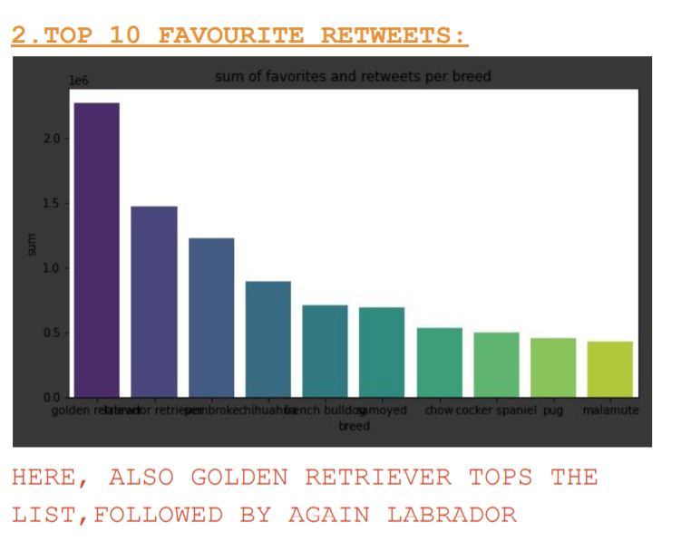
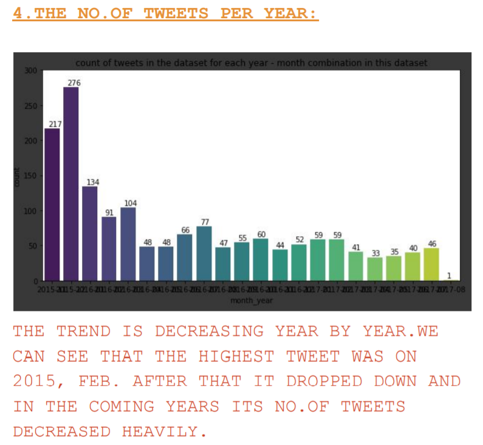
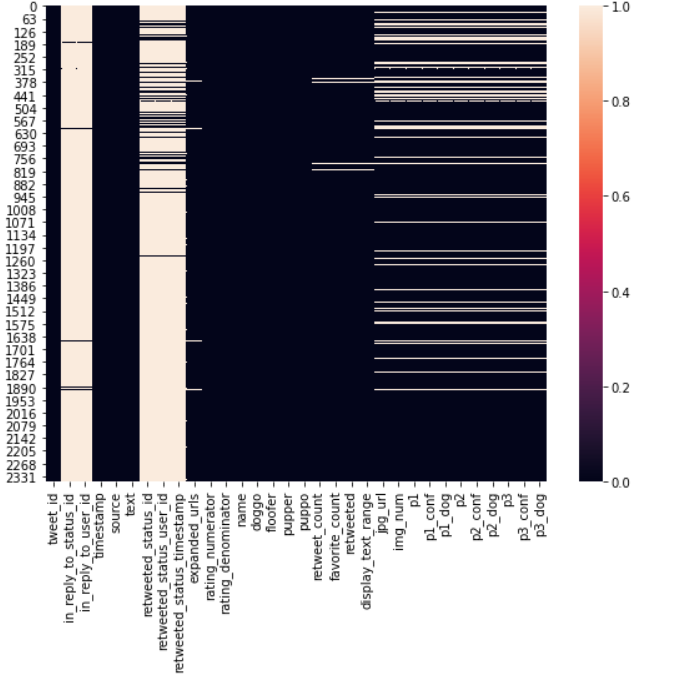

### TWITTER-ARCHIVE--EDA
Extracted archive of a very famous twitter account and performed EDA

### THE WRANGLING PART IN THIS PROJECT CONTAINS
1.GATHERING THE DATA
2.ASSESSING THE DATA
3.ANALYSING THE DATA

### GATHERING INSIGHTS:
1. WeRateDog Twitter Archive
(twitter-archive-enhanced.csv)
I downloaded the file from Udacity
2. Tweet image predictions (image_predictions.tsv)
To gather this data we are going to define the file
- url, request this url and write the content of the
response to a separate file.

### ASSESSING INSIGHTS:
1.Some columns had incorrect datatypes
2.Some dogs were not properly classified
3.There were incorrect names and retweet datas
4.Some ratings were not extracted correctly
5.Also there is a "_" instead of a whitespace in
the predictions
6.the columns doggo, floofer,pupper and puppo are
not easy to analyze and should be in one column
7.All three tables share the column tweet_id and
should be merged together.

### CLEANING INSIGHTS:
1.Merged the tables together
2.Dropped the replies, retweets and the
corresponding columns and also drop the tweets
without an image or with images which don't
display doggos
3.Cleaned the datatypes of the columns
4.Cleaned the wrong numerators - the floats on
the one hand (replacement), the ones with
multiple occurence of the pattern on the other
(drop)
5.Extracted the source from html code
6.Splitted the text range into two separate
columns
7.Removed the "None" out of the doggo, floofer,
pupper and puppo column and merge them into one
column
8.Removed the wrong names of name column
9.Reduced the prediction columns into two - breed
and conf
10. Cleaned the new breed column by replacing the
"_" with a whitespace and make them all
lowercase.

### ANALYSIS INSIGHTS:
1.The dogs displayed in the images are mostly
golden retrievers
2.The golden retriever and the labrador retriever
also lead the list of most favorite and
retweets.
3. Founded, that the number of tweets per month
decreased, while the retweets and favorites show
an uptrend. For the image numbers there is no
clear trend visible, the length of the tweets
got a little bit closer to the maximum of 130 in

### VISUALIZATION SCREENSHOTS

